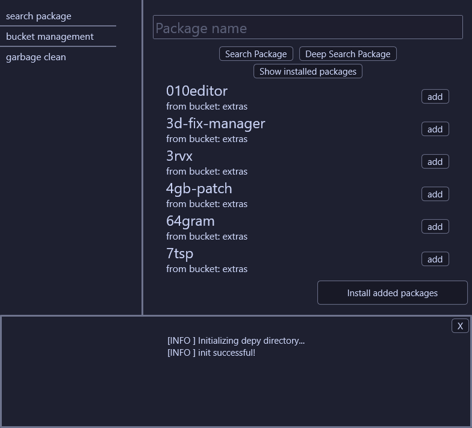

# Depy 

Depy is a dependency manager based on `scoop`. It automatically installs any program from a collection of over 3000+ packages.

Depy automatically manages and creates virtual environemnts similar to `python -m venv` that help you manage versions of apps cleanly.




## Instalation

**If you already have scoop installed** just open up powershell and run:

```
scoop install git
scoop install https://raw.githubusercontent.com/insertokername/depy/main/manifest/depy.json
```

**If you don't have scoop installed** there are just a couple of steps:


- **for 64 bit**
    First make sure you have [VCRUNTIME](https://learn.microsoft.com/en-us/cpp/windows/latest-supported-vc-redist?view=msvc-170#visual-studio-2015-2017-2019-and-2022) 

    And then open powershell and run:
    ```
    Set-ExecutionPolicy -ExecutionPolicy RemoteSigned -Scope CurrentUser
    Invoke-RestMethod -Uri https://get.scoop.sh | Invoke-Expression
    scoop install git
    ```
    Close and reopen powershell and then run:
    ```
    scoop install https://raw.githubusercontent.com/insertokername/depy/main/manifest/depy.json
    ```

- **for 32 bit**:
    Download [git](https://git-scm.com/downloads), make sure you have [VCRUNTIME](https://learn.microsoft.com/en-us/cpp/windows/latest-supported-vc-redist?view=msvc-170#visual-studio-2015-2017-2019-and-2022) 
    And then open powershell and run:
    ```
    Set-ExecutionPolicy -ExecutionPolicy RemoteSigned -Scope CurrentUser
    Invoke-RestMethod -Uri https://get.scoop.sh | Invoke-Expression
    ```
    Close and reopen powershell and then run:
    ```
    scoop install https://raw.githubusercontent.com/insertokername/depy/main/manifest/depy.json
    ```

**Now you're done!**

## Usage

### Gui

Open a terminal in the folder you wish to make a virtual environment in, run the command `depy-gui` and now the interface will open, you can now search the packages you wish to install. Once you find you pacakge just click on add install. Once you are done with selecting your needed packages just `Install added packages` and you're done!

### Cli

First we need to create a `depy.json` file that will declare all of our desired programs.

`depy.json`
```
[
    {
        "bucket_url": "https://github.com/ScoopInstaller/Main",
        "bucket_name": "main",
        "name": "grep",
        "version": "latest"
    },
    {
        "bucket_url": "https://github.com/ScoopInstaller/Versions",
        "bucket_name": "versions",
        "name": "python36",
        "version": "3.6.8"
    },
]
```

In this depy.json file we declared that we need to install `grep` from the `main` bucket, by using the `latest` tag it will always be set to the latest version available when updating with depy , and python version 3.6.8 from the `versions` bucket. Buckets are explained [here](#buckets).

After we define our `depy.json` we can just run:
```
depy
``` 
And everything will install automatically without polluting the environment PATH(in most cases).

Last thing we need to do is run:
```
.depyvenv\activate
```
Now all of our apps will be available to us and `(CURENTLY IN DEV SHELL)` should appear in front of the prompt. Until you close the shell you will have access to all the specified versions of the programs. On subsequent runs you will only need o run the activate script.

## Some more important info

**This installation system will have conflicts if you are using the scoop "use_isolated_path" config, very recomended you unset it if you are using it.**

This application does not cause conficts with existing scoop installed programs.

## Buckets

Buckets are repositories that contain a number of packages. Each bucket has its purpose:
- main: contains most cli applications and frameworks and etc
- extras: contains mostly gui apps and apps that don't fit the main bucket criteria
- versions: contains older versions of packages that have changed their install system and require special instructions compared to the newer packages.

You can also make your own [custom buckets](#adding-a-custom-bucket)

## depy.json

The format of a depy.json looks like this:

```
[   //an array of "packages"
    
    {   //each package is defined by:
        "bucket_url":"https://github.com/ScoopInstaller/Main"   //the github repository in which it is stored
        "bucket_name":"main"                                    //an identifier for that bucket
        "name":"generic_package",                               //the package name
        "version":"1.0",                                        //the package version
    }
]
```

- The name and version section are self explanatory. 
- The `bucket_url` represents the repository in which to search for the package in. 
- The `bucket_name` represents a label for that bucket.
- The `versions` can be set to `latest` so that every time you run `depy` or update via gui, it will automatically get the latest versions available in scoop.

## Adding a custom bucket:

First you should read a bit about scoop buckets from [here](https://github.com/ScoopInstaller/Scoop/wiki/Buckets). The proceed to use the [bucket template repo](https://github.com/ScoopInstaller/BucketTemplate) and **make sure your bucket directory is on the master branch.** After that you can just put the link to you repository in the `bucket_url` argument of the program that requires it (something like this: `"bucket_url":"https://github.com/ScoopInstaller/Extras"`)

## Compilation

**Compilation dependencies:**
- only rust

First install rust from [rustup](https://rustup.rs/). After that download the source code from github. Finally open the project in your preferred code editor and run `cargo build`. The project will be compiled under `target/Debug/depy.exe` and `target/Debug/depy-gui.exe`.,

## Garbage clean 

The garbage clean command uninstalls all packages from the cache, freeing up some space. 

**Cli**
```
depy -g
```
**Gui**
In the `garbage clean` menu, hit the `Cleanup Packages` button 

## Uninstalling

Uninstalling is done in two steps:

**Cli:**
```
depy -d
```
**Gui:**
In the `garbage clean` menu hit the `Uninstall Depy` button.

This uninstalls all apps under `%userprofile%/depy/scoop`.

Second:
```
scoop uninstall depy
```
This just uninstalls the exe itself which is very small.

## Resources used
While making this project I mainly had to read the [scoop wiki](https://github.com/ScoopInstaller/Main/tree/) and some crate documentations like for example  [druid](https://docs.rs/druid/latest/druid/) 
